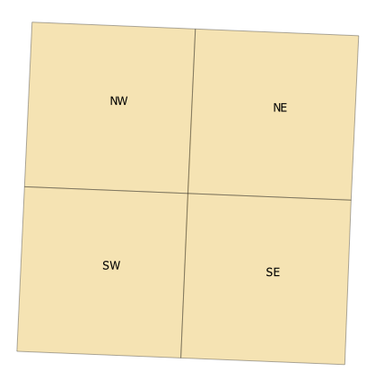
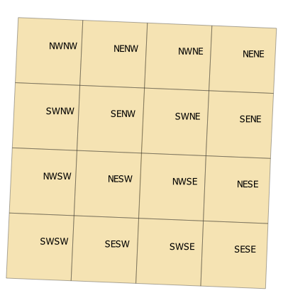
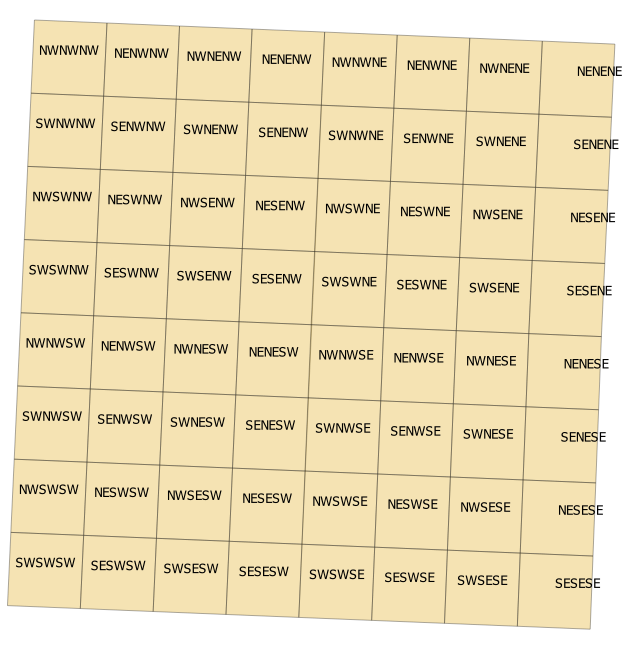

quarterquarter
==============

Break up square-ish polygons into quarters (4), quarter-quarters (16), or quarter-quarter-quarters (64).

quarters (``--operation q``):  
  
quarter-quarters (``--operation qq``):  
  
quarter-quarter-quarters (``--operation qqq``):  
  

#### CLI usage:
```
docker build -t quarterquarter .
docker run -it -v ./data:/data quarterquarter --operation q --input_shp /path/to/shapefile.shp --output_shp /path/to/shapefile_to_create.shp
```

#### Limitations:
Only designed to be used on north-oriented polygons with 4 sides.
